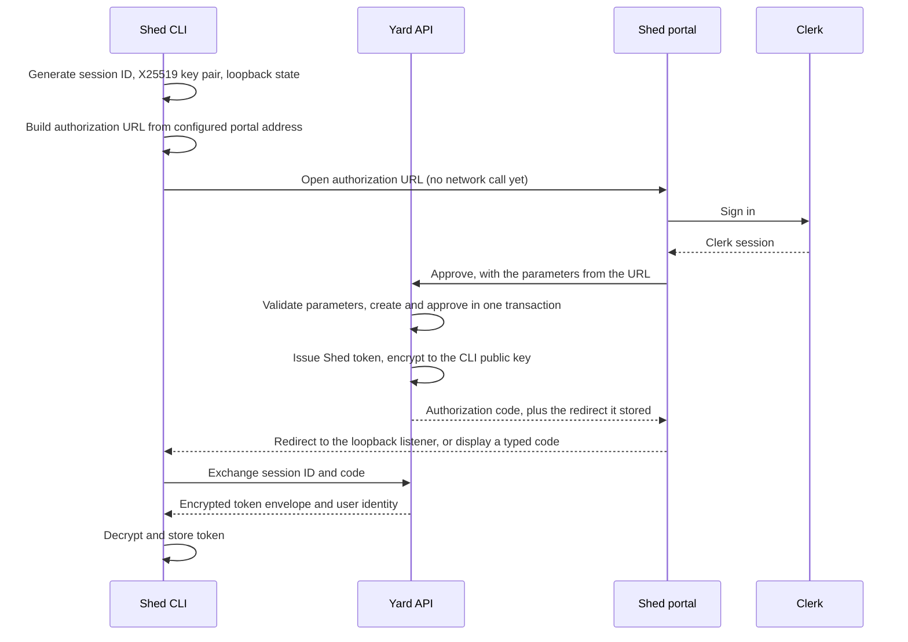

# CLI Authentication Protocol

This document specifies the authentication contract shared by the Shed CLI,
the future Clerk-backed portal, and Yard. The CLI implementation lives in this
repository; the portal and Yard portions are contracts for future work.

## Overview

The CLI uses a browser-assisted exchange. Clerk authenticates the person, Yard
authorizes the login and issues a Shed token, and the CLI receives that token
encrypted to an ephemeral key that never leaves the CLI process.

There are two ceremonies. **Protocol 2** is what the CLI speaks today: it builds
the authorization URL from its own configuration and reaches no network before
opening a browser, and the login session is created at the moment the approval
page approves it. **Protocol 1** is the original ceremony, in which the CLI
asked Yard to create the session and hand back a URL. Yard still serves it so
that a CLI released before protocol 2 keeps working.



Because the URL is built locally, an unreachable control plane can no longer
stop a browser from opening. The login still cannot succeed without Yard — the
approval page calls it — but the failure lands after someone has approved
something, where it can be explained, rather than before anything was shown.

The browser never receives the plaintext Shed token. It carries only a code that
authorizes the exchange, and the token behind that exchange is sealed to a key
only the CLI holds.

## Code Delivery

The code that authorizes the exchange is delivered one of two ways, decided by
whether the CLI is holding a loopback listener.

**Loopback delivery.** When the CLI opens the browser itself, it binds
`127.0.0.1:0` before advertising anything and passes `redirect_uri` and `state`
in the authorization URL. On approval the browser is navigated to
`http://127.0.0.1:<port>/callback?code=<code>&state=<state>`, and the code is
never displayed. That code is 32 random bytes as unpadded base64url: nobody
types it, so it is not built from the typable alphabet, and it is the only value
in the ceremony that does not travel through the authorization URL.

**Typed delivery.** With `--no-browser`, over SSH, or when the listener cannot
bind, no redirect is sent. Yard issues a ten-character Crockford Base32 code,
the approval page displays it, and the person types it into the terminal.

The stored session decides which shape the exchange expects. A session created
with a redirect must not accept the short form — that would let the shorter
alphabet be attacked on a session whose code was never meant to be read.

The redirect is pinned to the loopback literal on every side that touches it:
`http://127.0.0.1:<port>/callback`, ports 1024–65535, no query, no fragment, no
userinfo. `localhost` is deliberately rejected because it resolves through DNS
and can be pointed at an address the CLI does not hold. The `state` is 32 random
bytes and is compared in constant time by the listener, so a callback the CLI
did not initiate is ignored.

## Trust Boundaries

- Clerk proves the browser user's identity. It does not issue the CLI
  credential and does not decide Shed permissions.
- The portal obtains a Clerk session token and sends it to Yard in an
  `Authorization: Bearer` header. Yard must verify its signature, issuer,
  audience, expiry, and authorized party using Clerk's Go SDK or JWKS.
- Yard owns authorization, login-session state, token issuance, revocation,
  and audit data.
- The CLI owns its ephemeral private key and stored Shed token.
- All endpoints require HTTPS outside local development. Secrets and
  verification codes must not appear in URLs or logs.

## HTTP Contract

JSON field names use lower camel case. Binary values use unpadded base64url.
Times use RFC 3339 UTC. Unknown JSON fields may be ignored for forward
compatibility.

### Authorization URL (protocol 2)

The CLI builds this itself from its configured portal address. It makes no
request to Yard.

```
{portal}/cli/login
    ?v=2
    &session=<256-bit random identifier, base64url>
    &key=<X25519 public key>
    &name=<token display label>
    &redirect_uri=http://127.0.0.1:<port>/callback   (loopback delivery only)
    &state=<256-bit random value>                    (loopback delivery only)
```

Every parameter here is attacker-suppliable: anyone can write a link. None of
them is a secret, and Yard validates all of them again on approval before it
writes anything. The approval page must treat them as display data only.

The CLI names the session because it has to address the exchange later, and
under typed delivery nothing comes back to tell it what the name was.

### Create a login session (protocol 1, legacy)

`POST /v1/cli/auth/sessions`

```json
{
  "client": "shed",
  "tokenName": "cli_workstation_1753831200",
  "publicKey": "<X25519 public key>",
  "protocolVersion": "1",
  "redirectUri": "http://127.0.0.1:52100/callback",
  "state": "<256-bit random value>"
}
```

Successful response: `201 Created`

```json
{
  "sessionId": "<256-bit random identifier>",
  "authorizationUrl": "https://app.shed.dev/cli/login?session=<id>",
  "expiresAt": "2026-07-29T22:10:00Z"
}
```

`redirectUri` and `state` are optional and are supplied together or not at all.
This endpoint rejects `protocolVersion: "2"`: a version 2 session is never
created here.

### Approve a session

`POST /v1/portal/cli-auth/sessions/{sessionId}/approve`

The portal sends the current Clerk session token as a bearer token on the portal
API prefix. No user ID from the request body is trusted.

An empty body is protocol 1 and approves a session Yard already has. A protocol
2 approval carries the parameters from the authorization URL, and the session
comes into existence here:

```json
{
  "protocolVersion": "2",
  "client": "shed",
  "tokenName": "cli_workstation_1753831200",
  "publicKey": "<X25519 public key>",
  "redirectUri": "http://127.0.0.1:52100/callback",
  "state": "<256-bit random value>"
}
```

Successful response: `200 OK`

```json
{
  "verificationCode": "7K9M2X4QWD",
  "expiresAt": "2026-07-29T22:10:00Z",
  "redirectUri": "http://127.0.0.1:52100/callback",
  "state": "<256-bit random value>"
}
```

`redirectUri` and `state` are present only for loopback delivery, and are echoed
from the stored session rather than from the request. The approval page must
build its callback from these and never from the query string it was opened
with, so the browser is only ever sent to an address Yard validated.

Yard stores only an HMAC-SHA256 digest of the code, made with a server-side
pepper, and limits failed exchange attempts to five. Approval is idempotent for
the same Clerk user: a repeat approval rotates the code against the envelope
already sealed, without minting a second token. It must reject approval by a
different user.

Under protocol 2, a session id that already exists is only re-approvable with
the public key its envelope was sealed to. A mismatch is reported as an unknown
session, because confirming that the id exists would be an oracle.

During approval Yard generates the opaque Shed token and encrypted envelope
described below. The plaintext token exists only while constructing the token
record and envelope.

### Exchange the verification code

`POST /v1/cli/auth/sessions/{sessionId}/exchange`

```json
{
  "verificationCode": "<the code the callback delivered, or the code that was typed>"
}
```

Successful response: `200 OK`

```json
{
  "encryptedToken": "<AES-GCM ciphertext>",
  "serverPublicKey": "<X25519 public key>",
  "nonce": "<12 random bytes>",
  "kdfSalt": "<32 random bytes>",
  "protocolVersion": "1",
  "user": {
    "id": "user_123",
    "email": "alice@example.com"
  }
}
```

The exchange and transition to `consumed` must be one database transaction.
The envelope is returned once and cleared after consumption. Error responses
use the standard Shed error body:

```json
{"error":"authorization_expired","message":"Login session expired"}
```

Expected statuses are `400` for malformed or invalid codes, `404` for unknown
sessions, `409` for consumed sessions, `410` for expired sessions, and `429`
after the attempt limit. Error messages must not reveal whether a particular
code character was correct.

### Current identity

`GET /v1/cli/me`

Requires a Shed bearer token.

```json
{
  "id": "user_123",
  "email": "alice@example.com"
}
```

### Revoke the current token

`DELETE /v1/cli/auth/tokens/current`

Requires a Shed bearer token and returns `204 No Content`. Revocation is
idempotent. A revoked token must fail subsequent authenticated requests.

The `protocolVersion` in this response is the **envelope** version, not the
ceremony version. It describes the sealed-token format, which both ceremonies
share and which has not changed. A CLI speaking protocol 2 still receives, and
must still accept, envelope version `1`.

## Encryption

Envelope version 1 uses:

1. Ephemeral X25519 key pairs generated independently by the CLI and Yard.
2. X25519 ECDH to calculate the shared secret.
3. HKDF-SHA256 with Yard's random 32-byte `kdfSalt`.
4. HKDF info `shed-cli-login-v1:` followed by the session ID.
5. AES-256-GCM with a fresh 12-byte nonce.
6. Associated data `shed-cli-login-v1:` followed by the session ID.

The plaintext is the complete opaque token. Any invalid length, decoding
failure, protocol mismatch, authentication failure, or extra plaintext data
must abort login without storing credentials.

## Shed Tokens and Persistence

Tokens have the form `shed_pat_` followed by unpadded base64url encoding of 32
random bytes. They remain valid until revoked. Yard stores only SHA-256 token
hashes and performs constant-time comparisons where applicable.

Durable transactional storage is required; PostgreSQL is recommended but the
provider is intentionally unspecified. The minimum records are:

- Login sessions: ID, CLI public key, verification-code HMAC, status, Clerk
  user ID, encrypted envelope, expiry, attempts, and consumed time.
- API tokens: token hash, Clerk user ID, name, creation time, last-used time,
  and revocation time.

Expired login sessions and cleared encrypted envelopes should be removed by a
periodic cleanup job. Raw tokens and verification codes must never be logged.

## CLI Credential Resolution

`SHED_TOKEN` has highest precedence and is never persisted. Otherwise the CLI
loads a token from the OS keyring using service `shed` and the normalized API
URL as the account. If the keyring is unavailable, it reads the legacy
owner-only configuration file. A successful login prefers the keyring and
falls back to that `0600` file with a warning.

`shed logout` revokes the active token before deleting local copies.
`shed logout --local` deletes local copies without contacting Yard.

## Failure and Recovery

- Cancellation leaves no token or private key on disk.
- Browser-open failures are non-fatal because the URL is always printed.
- A control plane that is unreachable when `shed login` starts no longer fails
  the command: the URL is printed and the browser opens regardless.
- A loopback listener that cannot bind is a downgrade to typed delivery, not a
  failure.
- While waiting on a callback the CLI keeps the keyboard live, so a redirect
  that never arrives — approved on another device, swallowed by a proxy — falls
  back to typing the code instead of hanging until the session expires.
- A portal address that is not an absolute URL fails before the browser opens
  and is reported as configuration, not as a network fault.
- Invalid, expired, consumed, or rate-limited sessions require a new
  `shed login`.
- Network and server errors preserve existing credentials.
- Storage failures fail login rather than reporting success; the CLI makes a
  best-effort revocation request for the newly issued, unstored token.
- Decryption or envelope-validation failures are treated as protocol/security
  errors and never trigger plaintext fallback.
